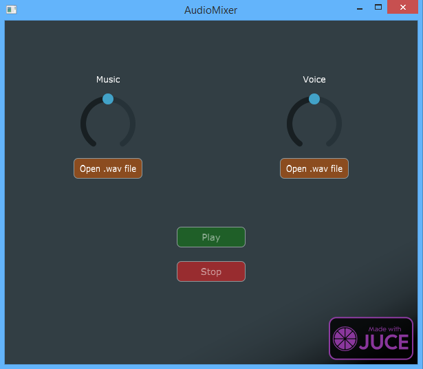

# AudioMixer
A standalone audio mixer. The goal of this application is to play two audio file, removing the signal from one to the other and finally set their gain.  
The typical example would be is using it with an accapela file and the original music file to allow adjusting the volume of the instruments independently from the voice.

## JUCE Framework
This application was built using the C++ JUCE Framework. For more information check both their website and github : 
https://juce.com/ 
https://github.com/WeAreROLI/JUCE/tree/af041a02d764e3120865664f5e4b8134914c2dd6 
If you want to build the application by yourself, simply open the __.jucer__ file with Projucer and set your builds and IDE configuration.

## The application
The mixer is divided in two sections, one for the music, and one for the voice. Each one got its own potentiometer to set its gain.
The audio source loaded in the __Voice__ section is actually substracted to the other, before any gain modification.
 
In order to start playing, you need to load both sources to unlock the button. When clicking on stop, the playtime get back to zero and both sources stop playing.

